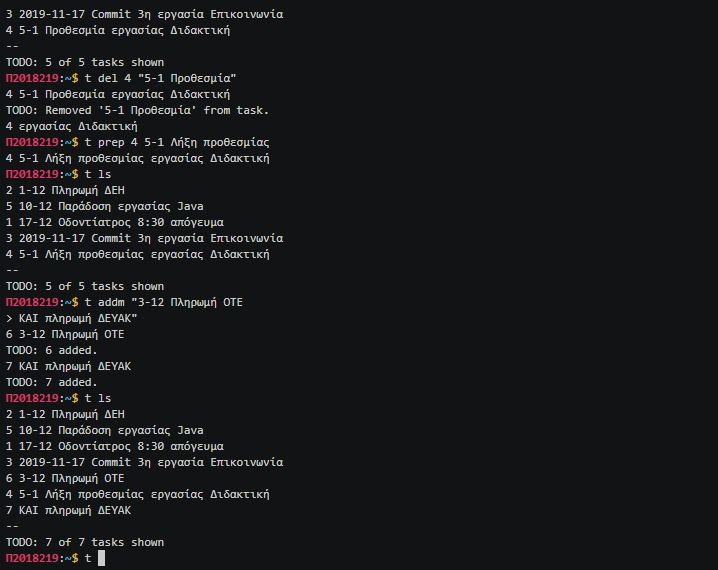

# Τίτλος εργασίας: Στη χώρα του linux (user land)

## Ονοματεπώνυμο: Χρήστος Μήλιος
## Αριθμός Μητρώου: Π2018219
### [Προφίλ στο github](https://github.com/p18mili1)

# Εισαγωγή
Η εργασία αυτή εκπονήθηκε στα πλαίσια του μαθήματος Επικοινωνία Ανθρώπου-Υπολογιστή του Γ' εξαμήνου σύμφωνα με το δείγμα τελικής αναφοράς που αναφέρεται στο [παράδειγμα καλής δομής των παραδοτέων](https://github.com/courses-ionio/hci/blob/master/projects/201XXXX/README.md) που έχει παρασχεθεί από τους διδάσκοντες.

#  Σύνοψη
Η εργασία χωρίζεται σε δύο μέρη (παραδοτέα) που το καθένα αποτελείται από δύο εργασίες σε Linux και μία εργασία συμμετοχικού περιεχομένου. Υλοποίησα και τα δύο παραδοτέα σύμφωνα με τις απαιτήσεις της εκφώνησης έχοντας την ευκαιρία στο 2ο παραδοτέο να επιλύσω κάποια προβλήματα που υπήρχαν κατά τη εκπόνηση του 1ου παραδοτέου. Το πρώτο μέρος προσπαθεί να εξοικειώσει το χρήστη με τις πλέον βασικές εντολές και λειτουργίες της γραμμής εντολών του linux καθώς επίσης και να του μάθει να προσθέτει υλικό σε συμμετοχικά έργα ενώ το δεύτερο μέρος προωθεί το χρήστη σε ένα ψηλότερο επίπεδο πάντα από τη γραμμή εντολών του linux και να προσθέτει δικό του έργο σε συμμετοχικά έργα.

#  Σύντομη ανάλυση σχετικών έργων και εργαλείων
Το λειτουργικό σύστημα που χρησιμοποήθηκε για την πραγματοποίηση των εργασιών είναι το Ubuntu 1804 το οποίο "έτρεχε" σε VirtualBox Manager 6.0 πάνω σε Windows 10. 

# Μέθοδος και τεχνικές ανάπτυξης
Για την συγγραφή και την εκτέλεση του κώδικα έγινε χρήση ενός τοπικού ide(Sublime text )αντί της διαδικτυακής πλατφόρμας του github. Στην συνέχεια , για κάθε παραδοτέο κατέγραψα το τί πρέπει να κάνω, πώς το κάνω και τι προβλήματα μπορεί να αντιμετωπίσω στο μέλλον. Μετά έγινε προσπάθεια υλοποίησης του κώδικα . Όσο αφορά το προγραμματιστικό κομμάτι πολλές φορές αντιμετώπισα προβλήματα λογικής και συντακτικής φύσεως για την αντιμετώπιση τους προέβη στις ακόλουθες ενέργειες. Αρχικά προσπαθούσα να δω που έγινε το λάθος στις περιπτώσεις που δεν κατάφερα να βγάλω άκρη μόνος. Έψαξα να βρω πώς έλυσαν το ίδιο η παρόμοιο πρόβλημα άλλοι προγραμματιστές. Χρήσιμες ιστοσελίδες για να μάθω περισσότερα για την d3 και για debugging αποτέλεσαν.

# Ενδεικτικές οθόνες

## Παραδοτέο 1
* Ενδεικτική εικόνα για την **Εργασία 1**

  

* Ενδεικτική εικόνα για την **Εργασία 2**

  

* Ενδεικτική εικόνα για την **Εργασία 3**

  

* Ενδεικτική εικόνα για την **Εργασία 4**

  

# Συμπεράσματα
Η εργασία  στο μάθημα HCI βοήθησε  στην απόκτηση δεξιοτήτων  που αφορούν το  λειτουργικό σύστημα Linux και τις τεράστιες δυνατότητες που παρέχει στους  χρήστες ,  καθώς  και  στην  εκμάθηση γλωσσών προγραμματισμού όπως η HTML, JavaScript και CSS. Επίσης μάθαμε να χειριζόμαστε την πλατφόρμα Github η οποία αποτελεί ένα ισχυρό εργαλείο για την δημιουργία μεγάλων projects, όπου η ομαδική συνεισφορά κρίνεται αναγκαία για την ολοκλήρωση τους. Τέλος, μέσω των δύο εργασιών συμμετοχικού περιεχομένου συνεισφέραμε στον εμπλουτισμό του βιβλίου του μαθήματος.

### Εγκατάσταση απαραίτητων εφαρμογών και επίδειξη του συστήματος
Αρχικά, έγινε η εγκατάσταση των απαιτούμενων πακέτων python και asciinema και στη συνέχεια η εγκατάσταση των πακέτων neofetch και mc (midnight commander). Το πρόγραμμα asciinema καταγράφει σε video το παράθυρο του shell σε ένα αρχείο τύπου .casτ, το οποίο είναι διαθέσιμο στο χρήστη online.

### Εκπλήρωση ζητούμενων Εργασίας 1

* [x] Αλλαγή του command prompt με τον ΑΜ με χρήση του editor nano.

* [x] Εμφάνση του αρχείου διαμόρφωσης παραμέτρων κελύφους .bashrc με τον file manager mc αλλά και με την εντολή less.

* [x] Εμφάνιση των κρυφών αρχείων με τις εντολές ls -la και more.

* [x] Εμφάνιση των πληροφοριών του συστήματος με την εντολή neofetch.

### Link παραδοτέου αρχείου asciinema: https://asciinema.org/a/275433

#
## Εργασία 2η
### Εξοικείωση με τις βασικές εντολές, ανάγνωση αρχείων τεκμηρίωσης επεξεργασία αρχείων
Έγινε η εγκατάσταση του επεξεργαστή κειμένου vim, του διαχειριστή αρχείων ranger και της εφαρμογής διόρθωσης λαθών εντολών thefuck.

### Link παραδοτέου αρχείου asciinema: https://asciinema.org/a/279946

### Εκπλήρωση ζητούμενων Εργασίας 2

* [x] Χρήση των man pages του κελύφους bash και της εντολής cp.

* [x] Χρήση μερικών εντολών του bash και δημιουργία ενός αντιγράφου του αρχείου διαμόρφωσης παραμέτρων .bashrc.

* [x] Επίδειξη βασικών λειτουργιών επεξεργασίας κειμένου στο αρχείο test_bashrc με τον editor vim.

* [x] Προεπισκόπηση, μετονομασία και διαγραφή αρχείων με τον file manager ranger.

* [x] Επίδειξη λειτουργίας του πακέτου thefuck με την εντολή fuck.

## Εργασία Συμμετοχικού Περιεχομένου
## Παραδοτέο Α
Προσθήκη πέντε (5) νέων εικόνων με λεζάντα στο αντίγραφο του βιβλίου.

### [Link αποθετηρίου gr](https://github.com/p18mili1/gr)

### [Link εκτελέσιμου](https://p18mili1.github.io/gr)

###  Link 1ης Εικόνας:
### [Ο μικροελεγκτής Atmega8 της Atmel](https://p18mili1.github.io/gr/gallery/Atmel_Atmega8/)

###  Link 2ης Εικόνας: 
### [Ο μικροελεγκτής Intel-P8051](https://p18mili1.github.io/gr/gallery/Intel_P8051/)

###  Link 3ης Εικόνας:
### [Ο μικροεπεξεργαστής MOS 6502](https://p18mili1.github.io/gr/gallery/MOS_6502/)

###  Link 4ης Εικόνας:
### [Ο μικροεπεξεργαστής Motorola MC6800](https://p18mili1.github.io/gr/gallery/Motorola_MC6800)

###  Link 5ης Εικόνας:
### [Ο μικροεπεξεργαστής Zilog_Z80](https://p18mili1.github.io/gr/gallery/Zilog_Z80/)

## Παραδοτέο 2

## Εργασία 3η
### Παραγωγικότητα με μία λίστα todo
Μετά την εγκατάσταση των απαιτούμενων αρχείων για την εκτέλεση τη εφαρμογής todo.sh δημιουργήθηκε στο αρχείο του κελύφους (.bashrc) η αντιστοίχιση t (alias) για την εντολή ~/todo.sh.

### Link παραδοτέου αρχείου asciinema: https://asciinema.org/a/281841

### Εκπλήρωση ζητούμενων Εργασίας 3

* [x] Δημιουργίας λίστας προγραμματισμένων εργασιών.

* [x] Επεξεργασία και προβολή κάποιων προγραμματισμένων εργασιών.

* [x] Ορισμός προτεραιότητας και σήμανση ως εκτελεσμένων προγραμματισμένων εργασιών 

* [x] Αντικατάσταση και διαγραφή προγραμματισμένων εργασιών.

* [x] Προβολή μόνο εργασιών με προτεραιότητα, αρχείου εκτελεσμένων εργασιών και αρχείου αναφοράς των ανοικτών           
      εργασιών και των εργασιών που έχουν εκτελεστεί.

## Εργασία 4η
### Διαχείριση συναντήσεων και εργασιών με το ημερολόγιο
Μετά την εγκατάσταση των απαιτούμενων αρχείων για την εκτέλεση τη εφαρμογής calcurse έγινε η διαμόρφωση των παραμέτρων της εφαρμογής για την προσαρμογή στις ανάγκες του χρήστη.

### Link παραδοτέου αρχείου asciinema: https://asciinema.org/a/286115

### Εκπλήρωση ζητούμενων Εργασίας 4

* [x] Δημιουργίας λίστας προγραμματισμένων συναντήσεων και εργασιών.

* [x] Επεξεργασία συναντήσεων και εργασιών, δηλαδή αλλαγή ημερομηνίας και περιεχομένου συναντήσεων,
     ορισμός προτεραιότητας προγραμματισμένων εργασιών, κτλ.

* [x] Εξαγωγή δεδομένων σε αρχεία με μορφοποίηση ical και pcal. 

* [x] Έξοδος από την εφαρμογή και εμφάνιση όλων των προγραμματισμένων συναντήσεων και εργασιών.

* [x] Εμφάνιση συναντήσεων βάσει κοινών λέξεων, εργασιών βάσει προτεραιότητας, κτλ.

* [x] Διαγραφή προγραμματισμένων συνατήσεων και εργασιών.

* [x] Επαναφορά δεδομένων από το αρχείο δεδομένων μορφοποίησης ical.

* [x] Διαγραφή διπλών εγγραφών.

## Εργασία Συμμετοχικού Περιεχομένου
## Παραδοτέο Γ
Προσθήκη της βιογραφίας του  **_Ivan Sutherland_**.

### [Link αποθετηρίου gr](https://github.com/p18mili1/gr)

### [Link εκτελέσιμου](https://p18mili1.github.io/gr)

###  Βιογραφία του Ivan Sutherland:
### [Link εκτελέσιμου](https://p18mili1.github.io/gr/biography/ivan-sutherland/)

