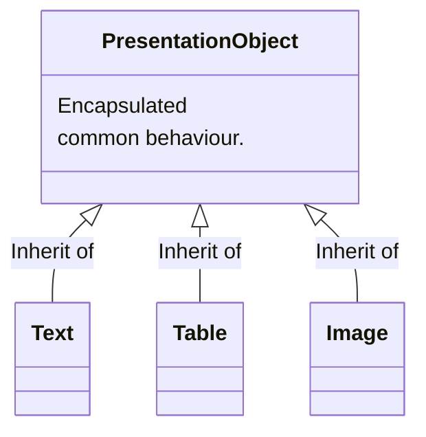
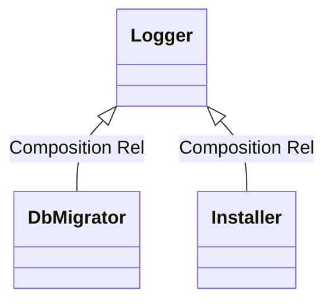
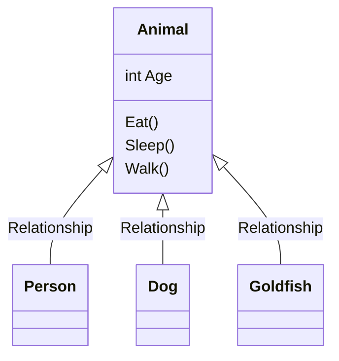
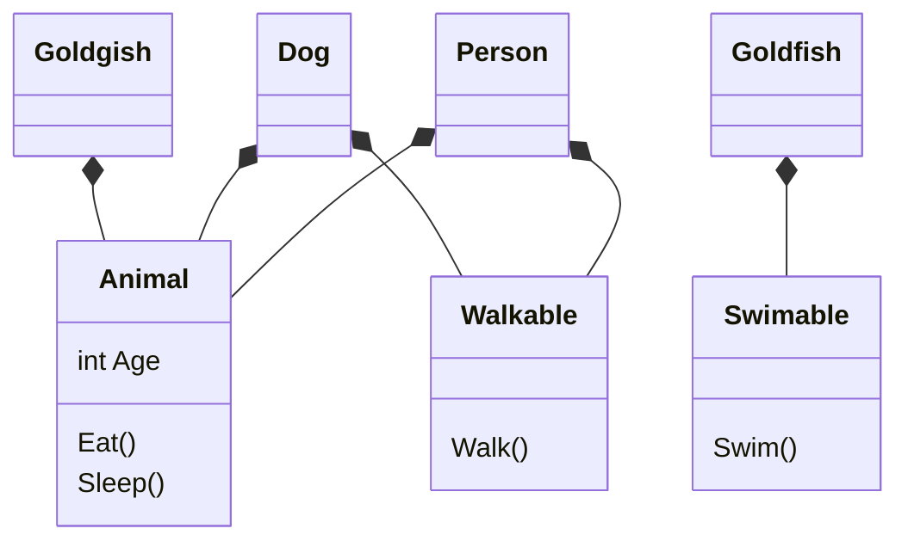
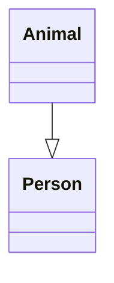

# Course Notes Template

## Classes

---

#### Introduction to Classes

--- 

###### Definition

are the building blocks of an application. Each class is responsible for a particular task in the application.

###### Anatomy of a Class

- Data (represented by fields)

- Behaviour (represented by methods / functions)

Representation in UML Language

```yml
Person
#Data
Name: string
Age: byte
Height: float
Weight: float
#Behaviour
Walk()
Talk()
Eat()
Sleep()
```

###### Object

Object is an instance of a class. Based on the above example, possible objects of this class could be John, Marry, Scott.

###### Declaring Classes

Classes fields should be private.

```csharp
public class Person
{
    // Here goes data and behaviours
}
```

###### Naming Conventions

- Pascal Case: When the first word of a parameter starts with uppercase. We use PascalCase to name <u>classes</u> and <u>functions</u>.

- camel Case: When the first word of a parameter starts with lowercase. We use camelCase to name a method's <u>variables</u>.

###### Creating new Objects

```csharp
Person person = new Person();
// var is a keyword. It is used as a convient, to not write the full
// name of the variables type.
var person = new Person();
```

###### Using Objects

After creating an object we can access its fields and methods.

```csharp
var person = new Person();
person.Name = "Tandalos";
person.Introduce();
```

###### Class Members

- Instance: accesible from an object

- Static: accesible from the class. We use static members to represent concepts that are singleton.
  
  ```csharp
  //Examples
  DateTime.Now
  Console.WriteLine()
  ```

Example

```csharp
public class Example
{
    // Can accessed from an object, after its instantiation.
    public void DoSomething();
    // Called directly from class. We dont have to create an
    // instance of it first.
    public static void DoSomethingElse();
}


public class OtherClass
{
    void Start()
    {
        // Calling a non-static method.
        var example = new Example();
        example.DoSomething();
        // Calling a static method.
        Example.DoSomethingElse();
    }
}
```

###### Parse Method

It is used to create an object based on the provided field. Example:

```csharp
class Person
{
    public string Name;
    //Creates a person object and asign its name.
    public static Person Parse(string str)
    {
        var Person = new Person();
        person.Name = str;

        return person;
    }
}

class Program
{
    static void Main(string[] args)
    {
        var person = Person.Parse("John");
    }
}
```

---

#### Constructors

---

###### Definition

A method that is called when an instance of a class is created. It must have the same name as its class. They do not have a return type. You can use them for initialization.

```csharp
public class Customer
{
    // Uppercase because it is a field.
    public string Name;

    // Default Constructor. If not implemented, it created by the compiler.
    public Customer()
    {

    }

    // Another Constructor.
    public Customer(string name)
    {
        // This is used to make sure that the Name is from this class.
        this.Name = name;   
    }
}
```

###### Constructor Overloading

When having a method by the same name but different signature. We overload constructors to make the initialization if this class easier. Example:

```csharp
public class Customer
{
    public Customer() { ... }
    public Customer(string name) { ... }
    public Customer(int id, string name) { ... }
}
```

You cant have 2  constructors with the same signature. Signature is the input parameters and the return type of a method/function. 

###### Real World Example

```csharp
public class Customer
{
    public int Id;
    public string Name;
    public List<Order> Orders;

    public Customer()
    {
        // Lists must be initialized. Or else you have Null Reference Exc.
        Orders = new List<Order>();
    }    

    public Customer(int id)
        : this() //This is used to call the default constructor.
    {
        this.Id = id;
    }

    public Customer(int id, string name)
        : this(id) //This means that its gonna call the constructor
    {              // that takes the id parameter.
        this.Name = name;
    }
}

public class Order
{
    public int Id;
}

class Program
{
    static void Main(string[] args)
    {
        var customer = new Customer();
        Console.WriteLine(customer.Id);
        Console.WriteLine(customer.Name);
    }
}
```

Use constructors only when you really want to initialize an object values. Use `:this()`as little as possible.

---

#### Object Initializers

--- 

###### Definition

An object initializer is simply a syntax for quickly initialising an object without the need to call one of its constructors. Used  to avoid creating multiple constructors. Example:

```csharp
// Create and initialise an object without using constructors.
var person = new Person
               {
                   FirstName = "Tandalos",
                   LastName = "Mpolis"
                };
```

---

#### Methods

---

###### Signature of a Method

The signature of a method is its name and the number and type of parameters.

```csharp
public class Point
{
    // Signature: 1. void 2. x 3. y 4. 2 parameters
    public void Move(int x, int y) {}
}
```

###### Overloading Methods

Having a method with the same name but different signatures

```csharp
public class Point
{
    public void Move(int x, int y) {}
    public void Move(Point new Location) {}
    public void Move(Point newLocation, int speed) {}
}
```

###### The Params Modifier

Used to call a method which has multiple parameters as input.

```csharp
public class Calculator
{
    public static int Add(params int[] numbers) {}
}

public class Program
{
    void Main()
    {
        //Initialise and pass an array
        var result = calculator.Add(new int[]{1, 2, 3, 4});
        //Using Params
        var result = calculator.Add(1,2,3,4);
    }
}
```

###### The Ref Modifier

It is used to pass and return a variable to a method. Example:

```csharp
public class Example
{
    public static void RefExampleMethod(ref int a)
    {
        a += 2;
    }
}

public class Program
{
    var a = 1;
    Example.RefExampleMethod(ref a);
    // At this point a has a value of 3.
}
```

###### Defensive Programming

- Ensure that there is no `ArgumentNullException` error. You ll need a Global Exception Handling Mechanism. Example:    
  
  ```csharp
  public void Move(Point newLocation)
  {
      // Checks the integrity of newLocation
      if(newLocation == null)
          throw new ArgumentNullException("newLocation");
  
      Move(newLocation.X, newLocation.Y);
  }
  ```

- Use TryParse instead of Parse, because on error Parse will make the program crash, TryParse will return a boolean. If you wanna use Parse you ll have to make an Exception Handling Mechanism.

- ```csharp
  int number;
  var result = int.Tryparse(str);
  if(result)
      Console.WriteLine(number);
  else
      Console.WriteLine("Conversion Failed");
  ```

--- 

#### Fields

--- 

###### Definition

A Field is a variable that is declared at class level. We use it to store details about the class. We can directly initialize variables that require no external variable for their initialization without using a constructor.

```csharp
public class Customer
{
    List<Order> Orders = new List<Order>();
}
```

###### Read-only Fields

We can declare a  field with the read-only modifier to make sure that its only assigned once. This is used to create some kind of safety in the application.

You might want to have an order list that cannot be initialized somewhere else. To make it clear and more readable you use read-only.

```csharp
public class Customer
{
    // This field should be initialized only once.
    readonly List<Order> Orders = new List<Order>();
}
```

---

#### Access Modifiers

---

###### Definition

Access Modifier is a way to control access to a class and/or its members. In C# there is a total of 5 modifiers.

- Public

- Private

- Protected

- Internal

- Protected Internal

###### Encapsulation / Information Hiding

We want to encapsulate (hide from other classes) some Fields or Methods.

In practice

- Define fields as private

- Provide getter/setter methods as public

The Advantage of setters and getters is that we can provide additional functionallity when setting or getting a field. Example:

```csharp
public class Person
{
    // Private fields names should start with an underscore "_"
    private string _name;

    public void SetName(string name)
    {
        if(!String.IsNullOrEmpty(name))
            this._name = name;
    }

    public string GetName()
    {
        return Name; 
    }
}
```

---

#### Properties

---

###### Definition

A Property is a class member that encapsulates a getter/setter for accessing a field. We need it to create a getter/setter with less code. Example:

```csharp
public class Person
{
    private DateTime _birthdate;

    public DateTime Birthdate
    {
        get { return _birthdate; }
        set { _birthdate = value; }
    }
}
```

###### Auto - Implemented Property

```csharp
public class Person
{
    public DateTime Birthdate { get; set; }
}
```

---

#### Indexers

---

###### Definition

Indexer is a way to access elements in a class that represents a list of values. Example:

```csharp
// An array of integers.
var array = new int[5];
array[0] = 1;
// A list of integers.
var list = new List<int>();
list[0] = 1;
```

###### Real World Example

Http Cookie: An http cookie is a file that is sent from the browser to the web server. It is used to identify that user. Example:

```csharp
public class HttpCookie
{
    // Indexer. Used in collections(lists,arrays,dictionaries)
    // Key is the type of index.
    public string this[string key]
    {
        get { ... }
        set { ... }    
    }
}

// Program
var cookie = new HttpCookie();
cookie.Expire = DateTime.Today.AddDays(5);


cookie["name"] = "Tandalos";
cookie.SetItem("name", "Tandalos");

// With Indexer
var name = cookie["name"];
// Without an indexer we need a method to do that.
var name = cookie.GetItem("name");
```

###### Dictionaries Example

If you are working on a class that has the schemantic of a collection, use indexer.

```csharp
public class HttpCookie
{
     // Dictionary Private ReadOnly Field.   
    private readonly Dictionary<string, string> _dictionary;
    //Default Initialization Constructor
    public HttpCookie()
    {
        _dictionary = new Dictionary<string, string>();
    }
    // Dictionary Indexer, type of string because dictionary's 
    // index is also string type.
    public string this[string key]
    {
        get { return _dictionary[key]; }
        set{ _dictionary[key] = value; }
    }
}

public class Program
{
    var cookie = new HttpCookie();
    cookie["name"] = "Tandalos";
    Console.WriteLine(cookie["name"]);
}
```

--- 

## Association between Classes

---

#### Class Coupling

---

###### Definition

Coupling is a measure of how interconnected classes and subsystems are.

###### Tithtly Coupled Application

When they are a lot of dependencies between classes. For example if Class D depents on class C and class C depends on class B and class B depends on class A. When you have so many dependencies you may break things as you modify this classes.

###### Loosely Coupled

When you change a class you want that change to be isolated. You dont want this change to affect other classes.

###### How to Design a Loosely Coupled Application

You need to understand

- Encapsulation

- The relationships between classes
  
   - Inheritance
  
   - Composition
  
   - Favour Composition over Inheritance

- Interfaces

---

#### Inheritance

---

###### Definition

Inheritance is a relationship between two classes that allows one to inherit code from the other. It is refered as an Is-A relationship. Example: a car is a vechicle.

###### Benefits

- Code reuse: We encapsulate some common code in one class and reuse it in other classes.

- Polymorphic behaviour

###### Example

Power Point like edditing tool. That has 3 insertion iptions. Text Table Image



PresentationObject can be called as a super class. And Text, Table and Images are subclasses.

###### Implementation

```csharp
public class PresentationObject
{
    // Comon shared code
}

public class Text : PresentationObject
{
    // Code specific to Text
}
```

###### Real World Example

```csharp
public class PresentationObject
{
    public int Width { get; set; }
    public int Height { get; set; }

    public void Copy()
    {
        Console.WriteLine("Object copied to clipboard");
    }

    public void Duplicate()
    {
        Console.WriteLine("Object was duplicated");
    }
}

public class Text : PresentationObject
{
    public int FontSize { get; set; }
    public string FontName { get; set; }

    public void AddHyperLink(string url)
    {
        Console.WriteLine("We added a link to" + url)
    }
}

public class Program
{
    static void Main(string[] args)
    {
        // You can access text's members
        // and members from PresentationObject
        var text = new Text();
        text.Width = 100;
        text.Copy();
    }
}
```

---

#### Composition

---

###### Definition

Composition just like inheritance is an another kind of relationship between two classes that allows one to contain the other. We refer to a composition with a Has-a relationship. Example: Car has an Engine.

###### Benefits

- Code re-use

- Flexibility

- A means to loose-coupling.

###### Example

Imagine that you are designing an application and you need a class called 

- DbMigrator that is responsible for migrating our database. This class will be responsible for creating new tables, populazing them width data, dropping columns etc. As part of that it requires some login.

- Installer, just like DbMigrator requires logging.

So login is a task common between those 2 classes. So we can create a class called logger that is responsible for logging information text file.



###### Implementation

```csharp
public class Installer
{
    private Logger _logger;

    public Installer(Logger logger)
    {
        _logger = logger;
    }
}
```

###### Real World Example

```csharp
public class Logger
{
    public void Log(string message)
    {
        Console.WriteLine(message);
    }
}


public class DbMigrator
{
    private readonly Logger _logger

    public DbMigrator(Logger logger)
    {

    }

    public void Migrate()
    {
        _logger.Log("Migrating..")
    }
}


public class Installer
{
    public readonly Logger _logger;

    public Installer(Logger logger)
    {
        _logger = logger;
    }

    public void Install()
    {
        _logger.Log("We are installing the application");
    }
}


class Program
{
    static void Main(string[] args)
    {
        // Creating a new Logger
        var dbMigrator = new DbMigrator(new Logger());
        // Asign a logger
        var logger = new Logger();
        var installer = new Installer(logger);

        dbMigrator.Migrate();
        installer.Install();
    }
}
```

###### Composition or Inheritance

Composition is more flexible and its realationships are more loose than when using Inheritance. Many developers say favour Composition over Inheritance.

---

#### Favour Composition over Inheritance

---

###### Problems with inheritance

- Easily abused by amateur designers/ developers

- Large hierarchies

- Fragility

- Tightly coupling

###### Example

Imagine you are creating a Game and you want to introduce the concept of a person and a dog.



The problem is that Person and Dog doesnt walk the same way, moreover Goldfish cant even walk. We should create another subclass called Mamal where it has the capability to walk and then we can derive person and dog from that class. Thats how inheritance can be abused and make large hierarchies which are fragile. Any inheritance relationship can be translated to Composition.

###### More Flexible Example using Compositions



We can now add more animals using the existing classes. Without braking things because it has minimal or 0 impact on other classes.

###### Benefits of Composition

- Great flexibility

- Eventually loose coupling



The problem with inheritance is that every time we make a change on person we may need to recompile Animal class or even change it. With Compositions we dont and we can replace the Animal class with an IAnimal Interface.

###### Summary

There are 2 types of relationship between classes

- Inheritance (Is-a)
  
   - Pros: Provides code reuse, easier to understand than Composition
  
   - Cons: It creates Tightly coupled, frigile, can be abused

- Composition (Has-a)
  
   - Pros: Code re-use, great flexibility, loose coupling
  
   - Cons: A little harder to understand

Inheritance is not necessarily a bad thing. Both inheritance and composition are great techniques when used apropertelly. Just because in the real world we thing of relationships that are Is-a or Has-a doesnt mean we have to model it the same way.

---

## Inheritance - Second Pillar of OOP

---

#### Access Modifiers

---

###### Black Box

A metaphore often used in object-oriented programming is Black Box. You dont know whats inside the box. There is a button on the box and thats the only thing we can see. We want to design our applications to look like a black box.

###### Access Modifier Types

- Public : Accessible from everywhere

- Private : Only accessible from the class

- Protected: Is only accessible from the class and its derived classes
  
   - Avoid it when you can and use Private instead.

- Internal: Accessible only from the same assembly, we use it to define classes not members.

- Protected Internal: Accessible only from the same assembly or any derived classes

---

#### Constructors and Inheritance

---

###### You need to know

Constructor Inheritance

- During the instantiation, base class constructors are always executed first.

- Base class constructors are not inherited. On Derived classes you have to refine its constructors.

###### Example

```csharp
public class Vechicle
{
    private string _registrationNumber;
    // Vechicle Constructor
    public Vechicle(string registrationNumber)
    {
        _registrationNumber = registrationNumber;
    }
}


public class Car : Vechicle
{
    // Redifined Constructor
    public Car(string registrationNumber)
        // Calls the Vechicle Constructor. Can Only Accessed this way,
        // because _registrationNumber is private.
        : base(registrationNumber)
    {
        // Initialise fields specific to the car
    }
}
```

---

#### Upcasting and Downcasting

---

###### Upcasting

```csharp
public class Shape { ... }

public class Circle : Shape { ... }


public class Program
{
    void Main()
    {
        //No conversion is required. Because shape its is base class.
        Circle circle = new Circle();
        Shape shape = circle;
    }
}
```

###### Downcasting

```csharp
public class Shape { ... }

public class Circle : Shape { ... }


public class Program
{
    void Main()
    {
        //We can convert it using an explicit cast. You can only cast it
        // to base classes.
        Circle circle = (Circle)shape;
    }
}
```

###### The as keyword

When we use the as keyword. If the object cannot be converted we wont get an Exception Error, Instead when its returned it is gonna be null. So we can check the result and do whatever we want with this object.

```csharp
Car car = (Car) obj;


Car car = obj as Car;
if(car != null)
{
    ...
}
```

###### The is keyword

```csharp
if (obj is Car)
{
    Car car = (Car) obj;
}
```

###### Real World Example

A program like PowerPoint

```csharp
public class Shape
{
    public int Width { get; set; }
    public int Height { get; set; }
    public int X { get; set; }
    public int Y { get; set; }

    public void Draw() { ... }   
}

public class Text : Shape
{
    public int FontSize { get; set; }
    public string FontName { get; set; }
}

class Program
{
    static void Main(string[] args)
    {
        // They are both references to the same memory block.
        // They have different views. Shape has more limited view.
        Text text = new Text();
        //Upcasting
        Shape shape = text;
        //Downcast
        Shape anotherShape = new Text();
        //Now we dont have limited view
        Text text = (Text) shape;
    }
}

class Program
{
    static void Main(string[] args)
    {
        // Can store any type
        ArrayList list = new ArrayList();
        list.Add(1);
        list.Add("String")
        list.Add(new Text());
        // Generic List can hold specified objects
        var anotherList = new List<Shape>();
    }
}
```

---

#### Boxing and Unboxing

---

###### Types in C#

- Value types
  
   - Are stored on the stack. They have a short lifetime. As soon as they go out of the scope, they imidiatelly kicked out of stack. Example:
     
      - All primitive types: byte, int, float, char, bool
     
      - The struct type

- Reference types
  
   - Are stored in the heap, a larger ammount of memory. We use heap to store objects that require a longer lifetime. Examples:
     
      - Any classes (Object, Array, String, DbMigrator, etc)

###### Boxing

The process of converting a value type instance to an object reference. Object is the base class for all objects.

```csharp
int number = 10;
object obj = number;
// or
object obj = 10;
```

###### Unboxing

Unboxing is the oposite of boxing

```csharp
object obj = 10;
int number = (int)obj;
```

###### Boxing / Unboxing

- They both have a performance penalty. Because of that extra object creation. Should be avoided.

---

## Polymorphism Third Pillar of OOP

---

#### Method Overriding

---

###### Definition

Method overriding is simply modifing the implementation of an inherited method. When we use inheritance there are times that we want to modify the implementation of a method.

###### Example

```csharp
public class Shape
{
    public void Draw()
    {

    }
}

public class Circle : Shape
{
    public virtual void Draw()
    {
        // Default Implementation
    }
}

public class Image : Shape
{
    // Gives us the ability to modify that method from the derived class
    public override void Draw()
    {
        // New Implementation goes here

        //Executes the behaviour of the parent class
        base.Draw();
    }

}
```

###### Virtual and Override Methods

When you make a method virtual, you give it the ability to be overrided. This way you can make less tight relationships leading to a more flexible program.

###### Real World Example

```csharp
    class Program
    {
        //Run Program with F10. To compile it line line.
        static void Main(string[] args)
        {
            var shapes = new List<Shape>();
            shapes.Add(new Circle());
            shapes.Add(new Rectangle());
            shapes.Add(new Triangle());
            var canvas = new Canvas();
            canvas.DrawShapes(shapes);
        }
    }

    public class Canvas
    {
        public void DrawShapes(List<Shape> shapes)
        {
            foreach (Shape shape in shapes)
            {
                shape.Draw();
            }
        }                                
    }

    public class Circle : Shape
    {
        public override void Draw()
        {
            //Any code specific to the circle class itself.
            Console.WriteLine("Draw a circle");
            //If we want we can execute the behaviour 
            // on the parent class as well.
            //base.Draw();
        }
    }

    public class Rectangle : Shape
    {
        public override void Draw()
        {
            Console.WriteLine("Draw a rectangle");
        }
    }

    public class Triangle : Shape
    {
        public override void Draw()
        {
            Console.WriteLine("Draw a triangle");
        }
    }

    public class Shape
    {
        public int Width { get; set; }
        public int Height { get; set; }

        //Making a class virtual gives us the abillity to override it.
        public virtual void Draw()
        {

        }
    }
```

---

#### Abstract Classes and Members

---

###### Abstract Modifier

Indicates that a class or a member is missing implementation. 

###### Example

The problem here is that we know how to draw a Circle, or a Rectangle but the concept of shape is abstract, we dont know how to draw a shape. So we can declare the Draw method as abstract to indicate that this method is missing implementation. So we leave it to the derived classes to give it implementation.

```csharp
public class Shape
{
    // Normal Virtual Class
    public virtual void Draw()
    {

    }
    // Abstract Class. It has no implementation because
    // it will provided by the derived classes
    public abstract void Draw();
}

public class Circle : Shape
{
    public override void Draw()
    {
        Console.WriteLine("Drawing a circle");
    }
}
```

###### Rules

- An abstract member can not include implementation.
  
  ```csharp
  public abstract void Draw();
  ```

- If an abstract member is declared as abstract the containing class need to be declared as abstract too
  
  ```csharp
  public abstract class Shape
  {
      public abstract void Draw();
  }
  ```

- In the derived class you must implement all abstract members in the base abstract class
  
  ```csharp
  public class Circle : Shape
  {
      public override void Draw()
      {
          // Implementation for Circle
      }
  }
  ```

- An abstract class cannot be Instantiated
  
  ```csharp
  var shape = new Shape(); //Won't Compile
  ```

###### Why to use Abstract

When you want to provide some common behaviour, while forcing other developers to follow your design.

###### Example

```csharp
public sealed class Circle : Shape
{
    public override void Draw()
    {
        Console.WriteLine("Drawing a circle");
    }
}
```

---

## Interfaces

---

#### What is an Interface

---

###### Definition

An Interface is a language construct that is similar to a class (in terms of syntax) but is fundamentally different.

###### Syntax

Unlike classes Interfaces have no implementation. Calculate is simple a declaration. Interface members do not have access modifiers (private, public etc.).

```csharp
public interface ITaxCalculator
{
    int Calculate();
}
```

I is an convention. All Interfaceses sould shart with I.

###### Why we need Interfaces

To build loosely-coupled applications. So making a change has minimal or 0 impact on other components.

---

#### Interfaces and Testability

---
